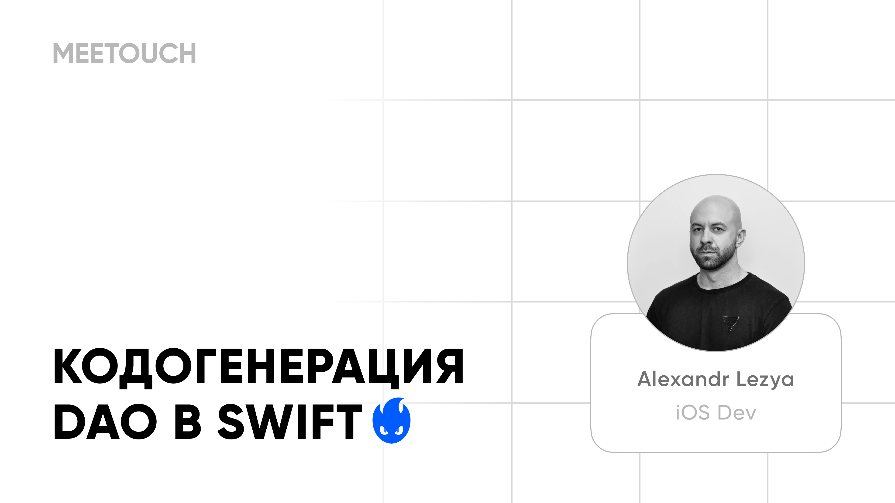

[![telegram-badge-channel]][telegram-channel-ios]
[![telegram-badge-forum]][telegram-forum-ios]
[![youtube-badge]][youtube-channel]

Во втором выступлении Саша рассказал, как полностью автоматизировать процесс создания и поддержки DAO, где мы увидели, как при помощи кодогенерации можно за секунды получить инфраструктуру для работы с базой данных всего приложения.

[youtube-badge]: https://img.shields.io/badge/YouTube-%23FF0000.svg?style=for-the-badge&logo=YouTube&logoColor=white
[youtube-channel]: https://meetouch.click/9vo

[telegram-badge-channel]: https://img.shields.io/badge/iOS%20Telegram%20Channel-2CA5E0?style=for-the-badge&logo=telegram&logoColor=white
[telegram-badge-forum]: https://img.shields.io/badge/iOS%20Telegram%20Forum-2CA5E0?style=for-the-badge&logo=telegram&logoColor=white
[telegram-channel-ios]: https://meetouch.click/829bd6
[telegram-forum-ios]: https://meetouch.click/e7c2c2